<a id="readme-top"></a>

<div align="center">

<!-- ASCII Art Banner -->
<pre>
███████╗██████╗ ███████╗██████╗  █████╗ ██╗  ██╗    ███████╗██╗  ██╗██╗██╗     ██╗     ███████╗
██╔════╝██╔══██╗██╔════╝██╔══██╗██╔══██╗╚██╗██╔╝    ██╔════╝██║ ██╔╝██║██║     ██║     ██╔════╝
███████╗██████╔╝█████╗  ██████╔╝███████║ ╚███╔╝     ███████╗█████╔╝ ██║██║     ██║     ███████╗
╚════██║██╔═══╝ ██╔══╝  ██╔══██╗██╔══██║ ██╔██╗     ╚════██║██╔═██╗ ██║██║     ██║     ╚════██║
███████║██║     ███████╗██║  ██║██║  ██║██╔╝ ██╗    ███████║██║  ╚██╗██║███████╗███████╗███████║
╚══════╝╚═╝     ╚══════╝╚═╝  ╚═╝╚═╝  ╚═╝╚═╝  ╚═╝    ╚══════╝╚═╝   ╚═╝╚═╝╚══════╝╚══════╝╚══════╝
</pre>

<h4>Open-source AI agent skills for DeFi, Web3, and the Sperax ecosystem</h4>

<p>
<strong>Publish. Install. Teach any AI agent about crypto — in seconds.</strong>
</p>

<p>
  <a href="https://clawhub.ai"></a>&nbsp;
  <a href="LICENSE"></a>&nbsp;
  <a href="https://sperax.io"></a>&nbsp;
  <a href="https://plutus.fi"></a>
</p>

</div>

<div align="center">


<picture>
  <source media="(prefers-color-scheme: dark)" srcset="public/demo.svg">
  <source media="(prefers-color-scheme: light)" srcset="public/demo.svg">
  
</picture>

<p>
  <a href="#-quick-start">Quick Start</a> &middot;
  <a href="#-skill-catalog">Catalog</a> &middot;
  <a href="#-publishing">Publishing</a> &middot;
  <a href="CONTRIBUTING.md">Contributing</a> &middot;
  <a href="docs/">Docs</a> &middot;
  <a href="#-faq">FAQ</a>
</p>

<p>
  &nbsp;
  &nbsp;
  &nbsp;
  
</p>

</div>


<!-- TABLE OF CONTENTS -->
<details>
  <summary><strong>Table of Contents</strong></summary>
  <ol>
    <li><a href="#-about">About</a></li>
    <li><a href="#-why-sperax-skills">Why Sperax Skills</a></li>
    <li><a href="#-key-features">Key Features</a></li>
    <li><a href="#-quick-start">Quick Start</a></li>
    <li><a href="#-skill-catalog">Skill Catalog</a> (skills, 8 categories)</li>
    <li><a href="#-architecture">Architecture</a></li>
    <li><a href="#-publishing">Publishing</a></li>
    <li><a href="#-machine-readable-context">Machine-Readable Context</a></li>
    <li><a href="#-ecosystem">Ecosystem</a></li>
    <li><a href="#-faq">FAQ</a></li>
    <li><a href="#-contributing">Contributing</a></li>
    <li><a href="#-license">License</a></li>
  </ol>
</details>

<p align="right">(<a href="#readme-top">back to top</a>)</p>

## 🧠 About

A curated collection of ** text-based AI agent skills** that teach any [OpenClaw](https://openclaw.ai)-compatible agent about DeFi protocols, on-chain analytics, portfolio management, and the [Sperax](https://sperax.io) + [Plutus](https://plutus.fi) ecosystems.

Each skill is a standalone `SKILL.md` file with YAML frontmatter — designed for the [ClawHub](https://clawhub.ai) public registry and compatible with any agent framework that consumes Markdown-based knowledge.

**Background** — [Sperax](https://sperax.io) is a DeFi + AI ecosystem on Arbitrum, comprising USDs (auto-yield stablecoin), SPA/veSPA governance, Sperax Farms, and ERC-8004 (on-chain AI agent identity). [Plutus](https://plutus.fi) is an allied multichain yield platform and governance aggregator — deeply integrated with Sperax through plsSPA (liquid 4-year max-locked veSPA). Together, these protocols represent a significant portion of Arbitrum's DeFi infrastructure.

[SperaxOS](https://github.com/sperax/sperax) is the open-source AI Agent Workspace that consumes these skills — with 45+ built-in DeFi tools, portfolio management, social features, and multi-agent orchestration. These skills power the knowledge layer that makes SperaxOS agents useful on day one.

<p align="right">(<a href="#readme-top">back to top</a>)</p>

## 🆚 Why Sperax Skills?

> Why use curated skills instead of rolling your own agent knowledge?

| | **Sperax Skills** | RAG / Vector DB | Fine-Tuning | Prompt Engineering |
|:---|:---:|:---:|:---:|:---:|
| **Setup time** | Seconds | Hours | Days | Minutes |
| **Cost** | Free | Embedding + hosting | GPU compute | Free |
| **Accuracy** | ✅ Expert-reviewed | Depends on chunks | Good | Hallucination-prone |
| **Updatable** | `git pull` | Re-index | Re-train | Manual |
| **Shareable** | ✅ ClawHub registry | ❌ Private | ❌ Private | ❌ Copy-paste |
| **Multi-agent** | ✅ Any OpenClaw agent | Framework-specific | Model-specific | Agent-specific |
| **DeFi depth** | skills, 7,500 lines | You build it | You label it | You write it |

**Sperax Skills give your agent expert DeFi knowledge with zero infrastructure.**

<p align="right">(<a href="#readme-top">back to top</a>)</p>

## ✨ Key Features

* **Instant knowledge** — Copy a Markdown file. No fine-tuning, no RAG setup, no embeddings.
* **expert skills** — Covering Sperax, Plutus, DeFi mechanics, market intelligence, and more.
* **OpenClaw compatible** — Proper YAML frontmatter. Publish to [ClawHub](https://clawhub.ai) in one command.
* **Public-safe** — No internal codebase details, no API keys, no private architecture exposed.
* **Read-only / informational** — No execution or transaction logic. Safe for any marketplace.
* **Chain-aware** — Arbitrum-first with multi-chain context (Berachain, Superseed, BNB Chain).
* **CI-validated** — Automated slug, frontmatter, and sensitive-pattern checks on every PR.
* **Machine-readable** — `llms.txt` and `llms-full.txt` for bulk LLM consumption.

<p align="right">(<a href="#readme-top">back to top</a>)</p>

## 🚀 Quick Start

### Install via ClawHub CLI

```bash
# Install the CLI
npm install -g @openclaw/clawhub

# Search for Sperax skills
clawhub search sperax

# Install a skill
clawhub install sperax-usds-guide
```

### Use Directly

Each skill is self-contained. Copy any `skills/<slug>/SKILL.md` into your agent's context:

```bash
# Clone and use
git clone https://github.com/sperax/sperax-skills.git
cp sperax-skills/skills/defi-yield-strategies/SKILL.md ~/my-agent/skills/
```

### For SperaxOS

These skills are automatically loaded by [SperaxOS](https://github.com/sperax/sperax) agents. No manual setup needed — they power the built-in knowledge of every DeFi agent in the workspace.

<p align="right">(<a href="#readme-top">back to top</a>)</p>

## 📚 Skill Catalog

### 🏦 Sperax Ecosystem (5)

> Core skills covering the [Sperax](https://sperax.io) protocol — USDs auto-yield stablecoin, SPA governance, no-code farming, and ERC-8004 agent identity.

| Skill | Description |
|-------|-------------|
| [`sperax-ecosystem-overview`](skills/sperax-ecosystem-overview/) | Full ecosystem overview — USDs, SPA, Farms, ERC-8004, SperaxOS |
| [`sperax-usds-guide`](skills/sperax-usds-guide/) | USDs auto-yield stablecoin — minting, redeeming, yield mechanics |
| [`sperax-spa-staking`](skills/sperax-spa-staking/) | SPA staking, veSPA governance, xSPA rewards |
| [`sperax-farms-guide`](skills/sperax-farms-guide/) | No-code liquidity farming on Arbitrum |
| [`erc8004-agent-identity`](skills/erc8004-agent-identity/) | ERC-8004 on-chain AI agent identity standard |

### ⚡ Plutus Ecosystem (3)

> Skills covering [Plutus DAO](https://plutus.fi) — the multichain yield platform and Arbitrum-native governance aggregator. Includes plsASSETs, plvASSET vaults, and tokenomics.

| Skill | Description |
|-------|-------------|
| [`plutus-protocol-overview`](skills/plutus-protocol-overview/) | Full protocol overview — plsASSETs, vaults, $PLUTUS/$xPLUTUS tokenomics, governance |
| [`plutus-plsassets-guide`](skills/plutus-plsassets-guide/) | Liquid governance tokens — plsSPA, plsGRAIL, plsSYK, plsBERA, overcollateralization |
| [`plutus-vaults-guide`](skills/plutus-vaults-guide/) | Yield vaults — plvHEDGE, plvDOLO, plvLOOP, risk profiles, multi-chain deployment |

### 📊 DeFi Knowledge (11)

| Skill | Description |
|-------|-------------|
| [`defi-yield-strategies`](skills/defi-yield-strategies/) | Yield farming strategies and risk tiers |
| [`stablecoin-mechanics`](skills/stablecoin-mechanics/) | Stablecoin types, pegging, and safety evaluation |
| [`impermanent-loss-explained`](skills/impermanent-loss-explained/) | IL formulas for Uniswap V2 and V3, break-even analysis |
| [`defi-risk-assessment`](skills/defi-risk-assessment/) | Protocol risk scoring framework |
| [`crypto-portfolio-management`](skills/crypto-portfolio-management/) | Portfolio construction and rebalancing |
| [`mev-protection-guide`](skills/mev-protection-guide/) | MEV types and protection strategies |
| [`token-approval-safety`](skills/token-approval-safety/) | ERC-20 approval risks and management |
| [`dca-strategy-guide`](skills/dca-strategy-guide/) | Dollar cost averaging strategies |
| [`token-swap-best-practices`](skills/token-swap-best-practices/) | DEX aggregators, slippage, gas optimization |
| [`onchain-analytics-guide`](skills/onchain-analytics-guide/) | On-chain data analysis and tools |
| [`defi-lending-guide`](skills/defi-lending-guide/) | Lending protocol mechanics and strategies |

### 🤖 AI Agent + Web3 (4)

| Skill | Description |
|-------|-------------|
| [`ai-agent-defi-guide`](skills/ai-agent-defi-guide/) | Teaching AI agents DeFi fundamentals |
| [`agent-wallet-security`](skills/agent-wallet-security/) | Security for AI agents handling crypto wallets |
| [`arbitrum-defi-guide`](skills/arbitrum-defi-guide/) | Arbitrum ecosystem — protocols, bridges, opportunities |
| [`crypto-governance-guide`](skills/crypto-governance-guide/) | DAO governance mechanics and participation |

### 📈 Market Intelligence (5)

| Skill | Description |
|-------|-------------|
| [`crypto-price-data-guide`](skills/crypto-price-data-guide/) | Price pipeline (CEX → DEX → Oracle → Aggregator), free API alternatives |
| [`defillama-analytics-guide`](skills/defillama-analytics-guide/) | DeFi Llama API masterclass — TVL, prices, yields, stablecoins |
| [`chainlink-oracle-guide`](skills/chainlink-oracle-guide/) | Oracle architecture, reading feeds, Chainlink vs Pyth |
| [`crypto-news-aggregation`](skills/crypto-news-aggregation/) | News sourcing, RSS feeds, sentiment, daily briefing templates |
| [`whale-watching-guide`](skills/whale-watching-guide/) | Exchange flows, wallet tracking, Dune queries, smart money |

### 🔥 Hot Topics (5)

| Skill | Description |
|-------|-------------|
| [`gas-optimization-guide`](skills/gas-optimization-guide/) | Gas mechanics (L1 vs L2), cost comparison, timing strategies |
| [`airdrop-hunting-guide`](skills/airdrop-hunting-guide/) | Eligibility criteria, farming strategies, Sybil detection |
| [`crypto-market-sentiment`](skills/crypto-market-sentiment/) | Fear & Greed, social sentiment, on-chain indicators |
| [`token-discovery-guide`](skills/token-discovery-guide/) | On-chain screening, scam detection, evaluation framework |
| [`restaking-explained`](skills/restaking-explained/) | EigenLayer, LRT protocols, risk layers, AVS ecosystem |

### 🛠 Developer / Power User (5)

| Skill | Description |
|-------|-------------|
| [`subgraph-development-guide`](skills/subgraph-development-guide/) | The Graph — schema, mappings, deployment, queries |
| [`smart-contract-reading-guide`](skills/smart-contract-reading-guide/) | Reading verified contracts, Solidity for non-devs, ABI decoding |
| [`nft-analytics-guide`](skills/nft-analytics-guide/) | Floor prices, wash trading, ERC-721/1155/8004, valuation |
| [`cross-chain-bridge-guide`](skills/cross-chain-bridge-guide/) | Bridge architectures, trust assumptions, security history |
| [`defi-dashboard-building`](skills/defi-dashboard-building/) | Building analytics with free APIs |

### 📚 Reference (3)

| Skill | Description |
|-------|-------------|
| [`web3-glossary`](skills/web3-glossary/) | 150+ term glossary for Web3 and DeFi |
| [`crypto-tax-basics`](skills/crypto-tax-basics/) | Crypto taxation overview and DeFi tax implications |
| [`yield-vault-guide`](skills/yield-vault-guide/) | Yield vaults, auto-compounding, vault evaluation |

<p align="right">(<a href="#readme-top">back to top</a>)</p>

## 🏗 Architecture

```
sperax-skills/
├── .github/              # CI workflows, issue templates
│   └── workflows/
│       ├── ci.yml        # Validate skills, security scan
│       ├── publish.yml   # Publish to ClawHub on release
│       └── secret-scan.yml
├── .well-known/          # ClawHub registry discovery metadata
├── bin/
│   ├── validate.sh       # Validate all skills (slug, frontmatter, patterns)
│   └── publish-all.sh    # Bulk publish (--dry-run, --changed)
├── docs/
│   ├── style-guide.md    # Writing standards for skill content
│   ├── publishing.md     # ClawHub publishing workflow
│   └── skill-format.md   # YAML frontmatter specification
├── scripts/
│   └── generate-llms-txt.sh
├── skills/               # ← skill folders
│   ├── sperax-ecosystem-overview/
│   ├── plutus-protocol-overview/
│   ├── defi-yield-strategies/
│   └── ...
├── SKILL.md              # Root meta-index skill
├── llms.txt              # LLM context — summary (~50 lines)
├── llms-full.txt         # LLM context — complete (~7,500 lines)
├── CITATION.cff          # Academic citation metadata
└── package.json          # Scripts: validate, publish, generate
```

### Skill Format

Every skill follows the [OpenClaw](https://openclaw.ai) specification:

```yaml
---
name: skill-slug-name            # Lowercase, hyphens only
description: One-line summary     # Used by ClawHub search
metadata:
  openclaw:
    emoji: "📈"                  # Display icon
    homepage: "https://..."      # Link to source project
    requires: []                 # Dependency skills (optional)
---

# Skill Title

Markdown content — tables, code blocks, ASCII diagrams.
Minimum 100 lines of substantive educational content.
No private code, no API keys, no internal architecture.
```

<p align="right">(<a href="#readme-top">back to top</a>)</p>

## 📦 Publishing

### Publish to ClawHub

```bash
# Login with your GitHub account
clawhub login

# Publish a single skill
clawhub publish skills/sperax-usds-guide \
  --slug sperax-usds-guide \
  --version 1.0.0 \
  --tags latest \
  --changelog "Initial release"

# Bulk publish all skills
./bin/publish-all.sh
```

### Sync Changes

```bash
# Publish only changed skills
./bin/publish-all.sh --changed

# Dry run (preview what would be published)
./bin/publish-all.sh --dry-run
```

### Validate Before Publishing

```bash
# Run validation on all skills
./bin/validate.sh

# Regenerate LLM context files
./scripts/generate-llms-txt.sh
```

<p align="right">(<a href="#readme-top">back to top</a>)</p>

## 📡 Machine-Readable Context

This repo includes machine-readable context files for bulk LLM consumption:

| File | Purpose | Size |
|------|---------|------|
| [`llms.txt`](llms.txt) | Summary index of all skills | ~50 lines |
| [`llms-full.txt`](llms-full.txt) | Complete content of all skills | ~7,500 lines |
| [`SKILL.md`](SKILL.md) | Root meta-index (publishable to ClawHub) | ~80 lines |
| [`.well-known/clawhub.json`](.well-known/clawhub.json) | Registry discovery metadata | JSON |

<p align="right">(<a href="#readme-top">back to top</a>)</p>

## 🌐 Ecosystem

<div align="center">

| | Resource | Description |
|:---:|:---|:---|
| 🐾 | [**ClawHub Registry**](https://clawhub.ai) | Public skill marketplace — search, install, publish |
| 🟣 | [**Sperax Protocol**](https://sperax.io) | USDs stablecoin, SPA governance, Arbitrum DeFi |
| ⚡ | [**Plutus DAO**](https://plutus.fi) | Multichain yield platform, governance aggregator, plsSPA |
| 🤖 | [**SperaxOS**](https://github.com/sperax/sperax) | AI Agent Workspace — the platform these skills power |
| 🔗 | [**ERC-8004**](https://eips.ethereum.org/EIPS/eip-8004) | On-chain AI agent identity standard |
| 📖 | [**Documentation**](docs/) | Style guide, publishing workflow, skill format spec |

</div>

<p align="right">(<a href="#readme-top">back to top</a>)</p>

## ❓ FAQ

<details>
<summary><strong>What is an AI agent skill?</strong></summary>

<br/>

A **skill** is a Markdown file with YAML frontmatter that injects domain knowledge into an LLM-powered agent. Unlike fine-tuning or RAG, skills require zero infrastructure — just copy the file into your agent's context window and it immediately understands the topic.
</details>

<details>
<summary><strong>Do I need SperaxOS to use these?</strong></summary>

<br/>

No. These skills work with any agent framework that accepts Markdown-based knowledge — Claude, GPT, Cursor, Copilot, or any [OpenClaw](https://openclaw.ai)-compatible system. SperaxOS loads them automatically, but they're designed to be framework-agnostic.
</details>

<details>
<summary><strong>Are these safe for public marketplaces?</strong></summary>

<br/>

Yes. Every skill is read-only educational content. No API keys, no file paths, no internal architecture, no transaction execution logic. They pass automated sensitive-pattern scanning on every CI run.
</details>

<details>
<summary><strong>How do I add a new skill?</strong></summary>

<br/>

Fork → create `skills/your-skill-name/SKILL.md` → follow the [style guide](docs/style-guide.md) → run `./bin/validate.sh` → open a PR. Every skill needs valid YAML frontmatter and at least 100 lines of substantive content. See [CONTRIBUTING.md](CONTRIBUTING.md) for full details.
</details>

<details>
<summary><strong>What's the relationship between Sperax and Plutus?</strong></summary>

<br/>

[Plutus DAO](https://plutus.fi) is an allied protocol that deeply integrates with Sperax through **plsSPA** — a liquid receipt token for 4-year max-locked veSPA. This gives Plutus users Sperax governance power while maintaining liquidity. The Plutus skills cover this integration and Plutus's broader yield platform.
</details>

<details>
<summary><strong>Can I use these commercially?</strong></summary>

<br/>

Yes — [MIT License](LICENSE). Use them in commercial products, modify them, redistribute them. Attribution appreciated but not required.
</details>

<p align="right">(<a href="#readme-top">back to top</a>)</p>

## 🤝 Contributing

Contributions are what make open-source great. Any contribution you make is **greatly appreciated**.

1. Fork the project
2. Create your branch (`git checkout -b feat/amazing-skill`)
3. Add your skill in `skills/your-skill-name/SKILL.md`
4. Validate (`./bin/validate.sh`)
5. Commit (`git commit -m '✨ feat: add amazing-skill'`)
6. Push (`git push origin feat/amazing-skill`)
7. Open a Pull Request

See [CONTRIBUTING.md](CONTRIBUTING.md) for the full style guide and conventions.

<p align="right">(<a href="#readme-top">back to top</a>)</p>

## 📄 License

<div align="center">

Distributed under the [MIT License](LICENSE). See `LICENSE` for more information.

Sperax Foundation, 2025–2026

</div>

<p align="right">(<a href="#readme-top">back to top</a>)</p>

---

<div align="center">

Built with 🧠 by the [Sperax](https://sperax.io) team

[sperax.io](https://sperax.io) &nbsp;&middot;&nbsp;
GitHub [@sperax](https://github.com/sperax) &nbsp;&middot;&nbsp;
X [@SperaxDAO](https://x.com/SperaxDAO)

<p>
  
</p>

<br/>

<sub>⭐ If these skills helped your agent, consider starring the repo — it helps others discover it.</sub>

</div>
